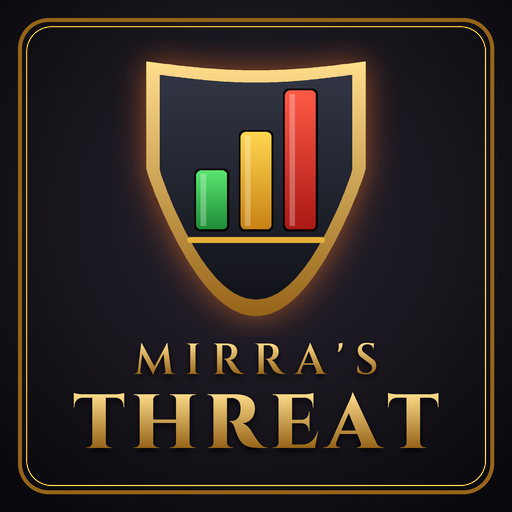

# Mirra's Threat

A lightweight WoW Forever addon that shows your threat on enemy nameplates as a compact bar and/or percentage, colored for your role.

## Features

- Threat bar and percentage below every enemy nameplate, styled like the resource bars: rounded frame, glossy fill
- Role-aware colors
  - **Tank:** green while you hold aggro, yellow when losing it, red once lost
  - **DPS / Healer:** green while safe, yellow when close to pulling, red once you pull aggro
- Three styles: bar + text, bar only, text only
- Text position inside the bar: left, center or right
- Adjustable width, bar height, font size, vertical offset and warning threshold
- Optional: hide at 0 % threat, only show while in a group
- Settings panel with live preview under **Options → AddOns → Mirra's Threat**
- Works with WoW Forever secret values (Interface 16001)

## Installation

Copy the addon into your WoW Forever `Interface/AddOns/MirraThreat/` folder
(the folder must be named `MirraThreat`, matching `MirraThreat.toc`).

## Commands

| Command          | Description                    |
|------------------|--------------------------------|
| `/mthreat`       | Open the settings              |
| `/mthreat tank`  | Switch to tank colors          |
| `/mthreat dps`   | Switch to DPS / healer colors  |
| `/mthreat debug` | Print debug information        |
